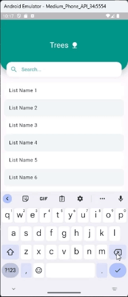

# Flutter Tips and Features Repository

Welcome to the Flutter Tips and Features repository! Here, you'll find a collection of Flutter code snippets, tips, and features to help you enhance your Flutter app development skills. Whether you're a beginner or an experienced developer, this repository aims to provide valuable insights and solutions to common challenges faced while working with Flutter.

## 1. SliverAppBar

### Overview

The SliverAppBar is a powerful widget in Flutter that allows you to create flexible app bar designs that integrate seamlessly with CustomScrollView. It's particularly useful for creating scrolling headers and dynamic app bar effects. This section provides tips and examples on how to effectively use SliverAppBar in your Flutter projects.

### Features

- **Flexible App Bar**: Create app bars that can expand and collapse as the user scrolls.
- **Scroll Effects**: Implement various scroll effects such as parallax, floating, and snap behaviors.
- **Customization**: Customize the appearance and behavior of the SliverAppBar to match your app's design requirements.
- **Integration**: Learn how to integrate SliverAppBar with other widgets like ListView, GridView, and CustomScrollView.

### Demo Video

### Resources

- [Flutter Documentation](https://flutter.dev/docs)
- [SliverAppBar Class](https://api.flutter.dev/flutter/material/SliverAppBar-class.html)
- [Flutter Cookbook - SliverAppBar](https://flutter.dev/docs/cookbook/lists/grid-lists/sliver-app-bar)

### Contributions

Contributions to this repository are welcome! If you have any tips, code snippets, or examples related to SliverAppBar or any other Flutter features, feel free to submit a pull request. Let's collaborate and build a valuable resource for the Flutter community!
