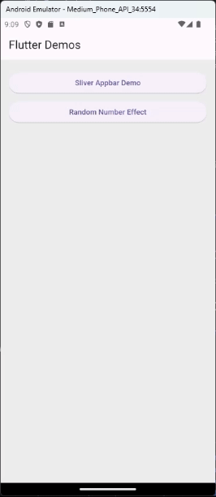

# Flutter Tips and Features Repository

Welcome to the Flutter Tips and Features repository! Here, you'll find a collection of Flutter code snippets, tips, and features to help you enhance your Flutter app development skills. Whether you're a beginner or an experienced developer, this repository aims to provide valuable insights and solutions to common challenges faced while working with Flutter.

## <a href="https://github.com/azazelyash/flutter-demos/blob/71cb88aa6d8a3a15eea178f3eb5448011b430fd7/lib/features/sliver_demo/presentation/screen/sliver_demo.dart">1. SliverAppBar</a>

### Overview

The SliverAppBar is a powerful widget in Flutter that allows you to create flexible app bar designs that integrate seamlessly with CustomScrollView. It's particularly useful for creating scrolling headers and dynamic app bar effects. This section provides tips and examples on how to effectively use SliverAppBar in your Flutter projects.

### Features

- **Flexible App Bar**: Create app bars that can expand and collapse as the user scrolls.
- **Scroll Effects**: Implement various scroll effects such as parallax, floating, and snap behaviors.
- **Customization**: Customize the appearance and behavior of the SliverAppBar to match your app's design requirements.
- **Integration**: Learn how to integrate SliverAppBar with other widgets like ListView, GridView, and CustomScrollView.

### Demo Video

## <a href="https://github.com/azazelyash/flutter-demos/blob/e805b0f8a5fccb869642653c101556feefa9f184/lib/features/random_number_effect/presentation/provider/random_number_effect_provider.dart">2. Number Effect</a>

### Overview

Check out this cool number effect I made in Flutter! The best part? It's crafted using pure Flutter magic – no external packages or animations required! Just a few while loops and powered by Provider for seamless state management.

### Demo Video

## <a href="https://github.com/azazelyash/flutter-demos/blob/cc341f3fe8905479975325eef23b02832d840fcb/lib/features/clip_path_demo/presentation/screen/clip_path_demo.dart">3. Clip Path</a>

### Overview

Discover how to create captivating custom shapes in Flutter using ClipPath, without relying on external packages or complex solutions. Just pure Flutter goodness!

### Demo Video

## <a href="https://github.com/azazelyash/flutter-demos/blob/cc341f3fe8905479975325eef23b02832d840fcb/lib/features/segmented_button_demo/presentation/screen/segmented_button_demo.dart">4. Segmented Buttons</a>

### Overview

Segmented buttons are a UI element with multiple buttons grouped together, allowing users to select one option at a time. They're commonly used for toggling between different modes or categories in mobile apps.

### Demo Video

### Resources

- [Flutter Documentation](https://flutter.dev/docs)
- [SliverAppBar Class](https://api.flutter.dev/flutter/material/SliverAppBar-class.html)
- [Flutter Cookbook - SliverAppBar](https://flutter.dev/docs/cookbook/lists/grid-lists/sliver-app-bar)

### Contributions

Contributions to this repository are welcome! If you have any tips, code snippets, or examples related to SliverAppBar or any other Flutter features, feel free to submit a pull request. Let's collaborate and build a valuable resource for the Flutter community!
